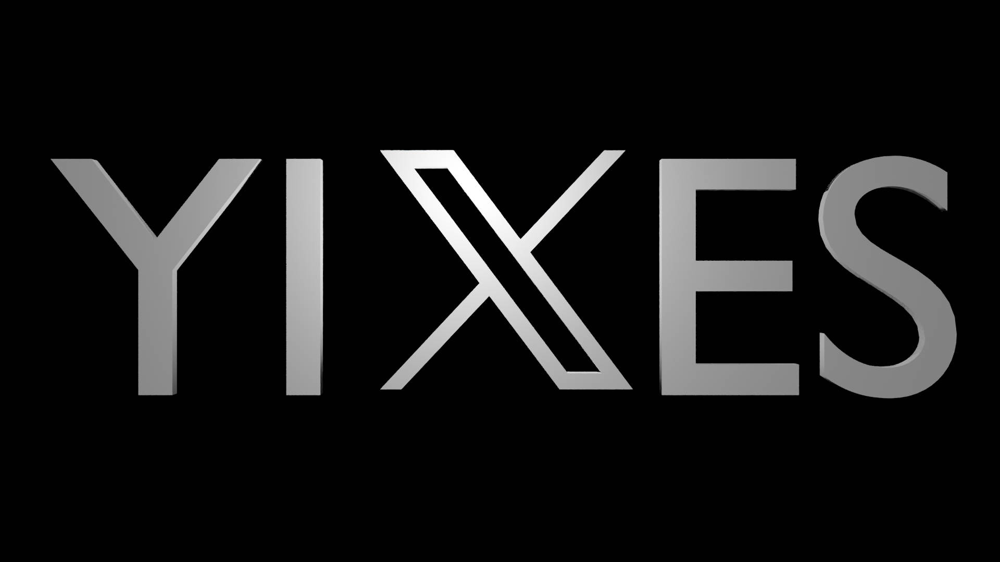

### Description

This program is the only program that 4303X used in the 2023-2024 vex over under year. We made it to states but unfortunately did not qualify for worlds. Since we are all seniors, this program will become something that future 4303 members might like to look at to see what we did in this year. Enjoy! - K :3

### Software

We used ez template to program our PIDs and auton selector. We used version 2.x, but there is definitely a higher version out there right now. The documentation can be found [here](https://ez-robotics.github.io/EZ-Template/). Everything else was made using pros. Pros is the main way that everyone programs their robot (PLEASE USE IT PLEASE PLEASE PLEASE). The documentation can be found [here](https://pros.cs.purdue.edu/v5/). If you have any questions about programming, first check those two sources. Second, try asking your teamates (4303 definitely has people that know the answer). Only after that (assuming youre on 4303) should you ask coach (he will probably just ask me to be honest).

### Autons

Our autons were created using "rapid prototyping" and [this tool](https://shazzzaammm.github.io/Auton-Creation-Tool/) that might be updated to your years game. If it isnt, just fork it and replace the image with an image of the desired field. Mobile isnt supported as of writing this, but someone might have done it by the time youre reading this. Check out our autons.cpp file to see what the structure we used is.

### User Control

We used a tank drive with 8 motors, 2 of which were PTO motors. The pto motors were allocated to the slapper and the intake. We had three sensors, each one used very often. Our inertial sensor was used for our chassis pid, our optic sensor was used to automatically detect triballs when we were match loading, and our rotation sensor ensured that our slapper was always charged and ready to shoot. Our endgame, PTO, and wings were all powered by pneumatic pistons. Most of the logic for our user control was contained in the helpers.cpp file (something i probably should have changed). The functions that end with "\_control" were the user control functions.

### Ports

| Subsystem  | Port(s)          |
| ---------- | ---------------- |
| Left Side  | 15, -8, -13, 14  |
| Right Side | -18, 17, 20, -19 |
| Slapper    | -19              |
| Intake     | 14               |
| IMU        | 16               |
| Optic      | 5                |
| Rotation   | 12               |
| PTO        | B                |
| Wings      | A                |
| Endgame    | C                |

### Controls

- T_Controls

  | Function        | Button(s) |
  | --------------- | --------- |
  | Hold Intake     | R1        |
  | Hold Outtake    | L1        |
  | Toggle Intake   | RIGHT     |
  | Toggle Outtake  | LEFT      |
  | Toggle Wings    | B         |
  | Toggle PTO      | R2        |
  | Toggle Slapper  | X         |
  | Hold Slapper    | A         |
  | Reverse Chassis | L2        |
  | Toggle Endgame  | UP        |

- G_Controls

  | Function        | Button(s) |
  | --------------- | --------- |
  | Hold Intake     | L1        |
  | Hold Outtake    | L2        |
  | Toggle Intake   | R1        |
  | Toggle Outtake  | R2        |
  | Toggle Wings    | A         |
  | Toggle PTO      | B         |
  | Toggle Slapper  | X         |
  | Hold Slapper    | Y         |
  | Reverse Chassis | DOWN      |
  | Toggle Endgame  | UP        |

- K_Controls

  | Function        | Button(s) |
  | --------------- | --------- |
  | Hold Intake     | R2        |
  | Hold Outtake    | R1        |
  | Toggle Intake   | L2        |
  | Toggle Outtake  | L1        |
  | Toggle Wings    | B         |
  | Toggle PTO      | A         |
  | Toggle Slapper  | Y         |
  | Hold Slapper    | X         |
  | Reverse Chassis | DOWN      |
  | Toggle Endgame  | UP        |

- A_Controls

  | Function        | Button(s) |
  | --------------- | --------- |
  | Hold Intake     | LEFT      |
  | Hold Outtake    | RIGHT     |
  | Toggle Intake   | R2        |
  | Toggle Outtake  | R1        |
  | Toggle Wings    | L2 or L1  |
  | Toggle PTO      | A         |
  | Toggle Slapper  | X         |
  | Hold Slapper    | Y         |
  | Reverse Chassis | DOWN      |
  | Toggle Endgame  | UP        |
